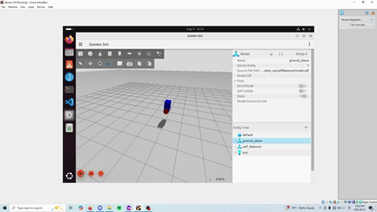
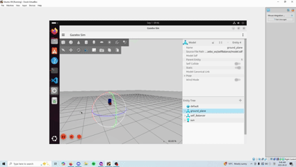
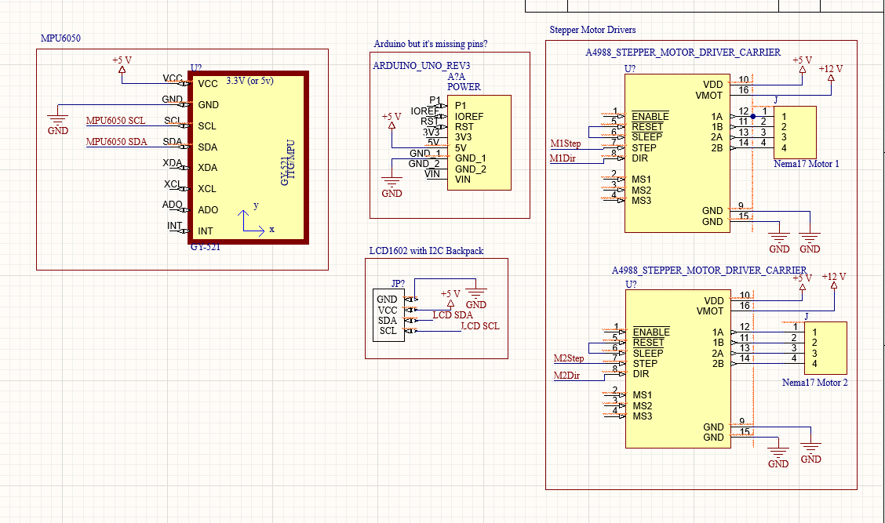

# Overview
Created a simple balancing robot model in Gazebo, with rectangular prism and wheels.

# Gazebo Simulation - PID

Model with Failed PID Parameters

Successful Balancing PID Program

# RL Controls
See ML projects for CartPole (Basic RL controls)

What's next: 
- Cascading PID Control. Angle PID inner loop, velocity PID outer loop
- Reinforcement learning controls in Gazebo (or Nvidia Isaac or MuJoCo)
- Properly tuning PID using classical control theory. 

# Physical Model
In progress, will use Arduino, Stepper Motors, MPU6050 IMU
